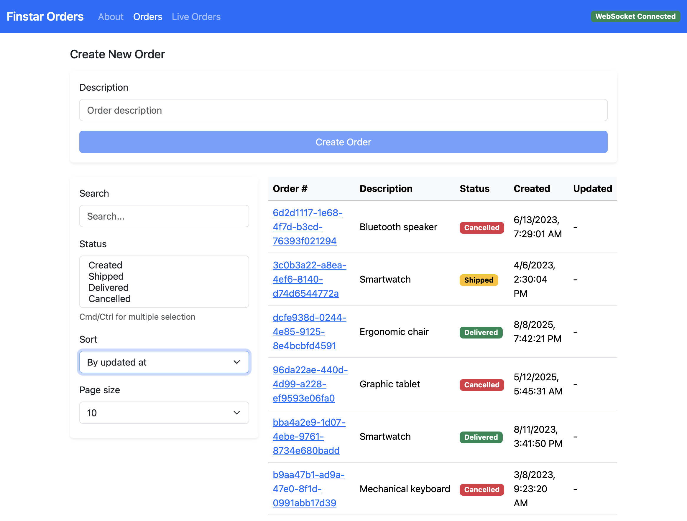
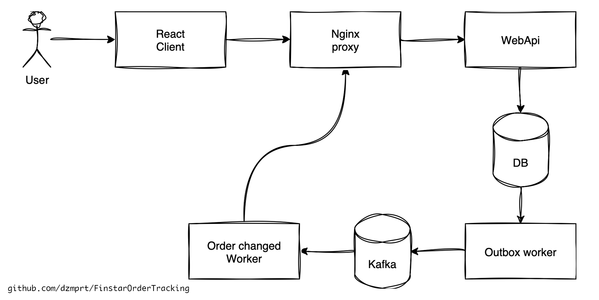

# This project is a test assignment for the Finstar company.

### Task 1

Implementation of a web application for tracking the status of orders (Order Tracking Application).

### Task 2

Write a SQL table function that will return daily payment amounts based on a ClientId and a date range (Date type). If there were no payments for a given day, the function should return 0. Date ranges can span multiple years.

[SQL for task 2](task2.sql)

# Task 1: Order Tracking Application

[](https://github.com/dzmprt/FinstarOrderTracking)




## Getting Started

### Prerequisites

- [Docker](https://www.docker.com)

#### 1. Clone the repository:

```sh
git clone https://github.com/dzmprt/FinstarOrderTracking.git
```

#### 2. Go to docker folder:

```sh
cd FinstarOrderTracking/Docker/Dev/
```

#### 3. Run docker compose:

```sh
docker compose up -d --build
```

#### 4. Access the application:

- [Frontend react app](http://localhost)
- [API swagger](http://localhost/swagger)
- WebSocket: `ws://localhost:8085/orders-statuses`
- [Kafka UI](http://localhost:9085)
- Database connection strings:
  - jdbc:postgresql://localhost:5432/fot.webapi?password=12345678&user=FotWebapi
  - "Server=localhost;Port=5432;Database=fot.webapi;User Id=FotWebapi;Password=12345678;"

## Functional Requirements

#### Backend (.NET 8, ASP.NET Core):

- Create and retrieve orders:
    - Order fields: OrderNumber, Description, Status (created, shipped, delivered, cancelled), CreatedAt, UpdatedAt.
- Asynchronous event publishing to Kafka/RabbitMQ when order status changes.
- Subscription service for order status changes, delivering notifications to users via WebSocket or Server-Sent Events.

#### Frontend (React):

- Interface for displaying and tracking order statuses:
    - Order list and form for creating new orders.
    - Order details page with real-time status tracking (auto-update via WebSocket/SSE).
    - (Optional) Tracked orders list using a state manager.

### Technical Stack & Requirements

- **Backend:**
    - .NET 8, ASP.NET Core Web API
    - ORM (preferably EF Core)
    - Database: PostgreSQL or Microsoft SQL Server
    - Kafka/RabbitMQ for event-driven communication
    - Observability: logging (console or file)
- **Frontend:**
    - React (TypeScript required)
    - WebSocket or Server-Sent Events
    - Redux/Zustand or similar for state management

### Implementation Requirements

- Clean, readable code, SOLID principles, separation into components and layers.
- README file with launch instructions for backend and frontend.

### Optional Requirements

- Docker container, docker-compose.yml for easy setup.
- Unit test coverage.
- XML documentation for classes, methods, and properties.
- Tracing (OpenTelemetry).

---

## Original Assignment (Russian)

> ТЗ №2 — Fullstack-разработчик
> 
> Задание 1
> 
>Цель задания:
> Реализация веб-приложения для отслеживания статуса заказов (Order Tracking Application).
>
> Функциональные требования:
>
> **Backend (.NET 8, ASP.NET Core):**
> - Создание и получение заказов: Заказ содержит поля: номер заказа (OrderNumber), описание (Description), статус (
    Status: создан, отправлен, доставлен, отменен), дата создания (CreatedAt), изменения (UpdatedAt).
> - Асинхронная отправка событий в очередь Kafka/RabbitMQ при изменении статуса заказа.
> - Сервис подписки на изменения статуса заказа для передачи уведомлений пользователям через WebSocket или Server-Sent
    Events.
>
> **Frontend (React):**
>   - Создание интерфейса для отображения и отслеживания статуса заказов:
>   - Список заказов и форма создания нового заказа.
>   - Страница деталей заказа с возможностью отслеживания статусов заказа (автообновление через WebSocket/SSE).
>   - (Опционально) Реализовать список отслеживаемых заказов с помощью менеджера состояния.
>
> **Технические требования и стек:**
>   - Backend:
>     - .NET 8, ASP.NET Core Web API
>     - Использование ORM системы для работы с БД. Предпочтительно - EF Core
>     - БД: желательно использовать PostgreSQL или Microsoft SQL Server
>     - Kafka/RabbitMQ для событийного взаимодействия
>     - Observability: логирование (вывод на консоль или в текстовый файл)
>   - Frontend:
>     - React (обязательное использование TypeScript)
>     - WebSocket, Server-sent events (по выбору)
>     - Redux/Zustand или аналогичные инструменты для простого управления состоянием
>
>  **Требования к реализации кода:**
>   - Чистый, читаемый код, SOLID, разделение на компоненты и слои.
>   - Создание файла README с инструкцией запуска backend и frontend (достаточно простого сценария запуска).
>
> **Дополнительные требования (опционально):**
>   - Docker-контейнер, docker-compose.yml (для удобной сборки и запуска).
>   - Покрытие кода unit-тестами.
>   - Наличие XML-документация к классам, методам и свойствам.
>   - Добавление трассировки (OpenTelemetry)

---

## System design




## Project Architecture

### Backend

- **ASP.NET Core Web API** (C#, .NET 8)
- **MitMediator**
- **FluentValidation**
- **Serilog**
- **Entity Framework Core** (ORM)
- **PostgreSQL** (database)
- **Kafka** (event bus)
- **Background services** for outbox pattern and WebSocket notifications
- **Logging** (console/file)
- **Docker** for containerization
- **Microsoft.Extensions.Caching.Memory**
- **xUnit**

### Frontend

- **React** (TypeScript)
- **Redux Toolkit** (state management)
- **Bootsrtap** (UI)
- **Vite** (build tool)
- **WebSocket**
- **Docker** for containerization

### Infrastructure

- **Docker Compose** (multi-service orchestration)
- **Nginx** (reverse proxy)
- **Kafka UI** (topic monitoring)

---

## Design Patterns Used

- **SOLID principles**
- **Repository pattern**
- **CQRS**
- **Outbox pattern**
- **Dependency Injection** (ASP.NET Core DI)
- **Observer pattern** (WebSocket notifications)
- **Layered architecture** (domain, application, infrastructure, presentation)
- **Component-based architecture** (React frontend)

---

## Features

- Order management: create, update, view, and filter orders
- Real-time order status updates via WebSocket
- RESTful API (ASP.NET Core WebApi)
- PostgreSQL database
- Kafka for event-driven architecture
- Outbox pattern for reliable event delivery
- Docker Compose for easy local development
- Nginx reverse proxy for unified API and frontend access
- Bootstrap UI for modern frontend design

### [License](./LICENSE)

### Author [Dmitry Protko](https://github.com/dzmprt)


